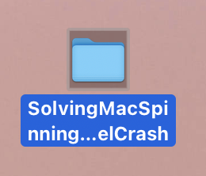
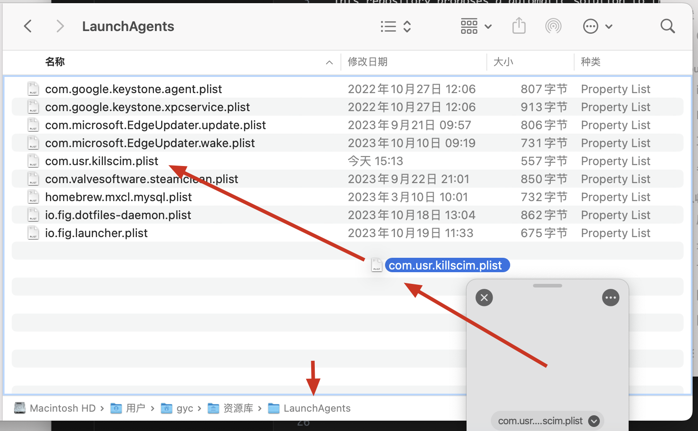
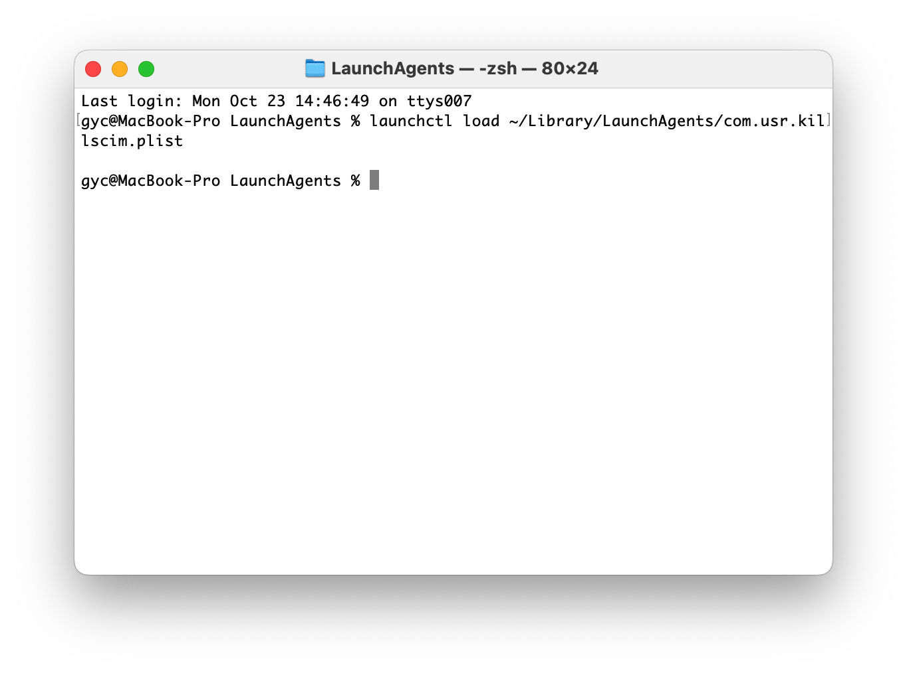

# SolvingMacSpinningWheelCrash

This repository proposes a automatic solution to the rainbow-colored spinning wheel crash problem in macOS Ventura or higher.

If you have experienced cursor turning into a spinning wheel when you were not able to operate anything (The cursor is still movable, but the OS is hardly responsive), then this method is worth trying. **It is a totally automatic and once-for-all solution.** 

## Usage

1. Clone this repository to your local machine.

   

2. Moving `com.usr.killscim.plist` file within the folder to `/Users/<your_user_name>/Library/LaunchAgents` .

   OR you can simply run the command below in your terminal:

   ```
   mv /path/to/com.yourname.killscim.plist ~/Library/LaunchAgents/
   ```

   > Replace `/path/to/` with the actual path to your '.plist 'file.

   

3. **Load this task**

   Run the following command in the terminal:

   ```bash
   launchctl load 	~/Library/LaunchAgents/com.usr.killscim.plist
   ```

   

4. **Logging and troubleshooting**

   If you need to see if the task is running or look for any possible problems, look at '/var/log/system.log'. You can view this log using the 'Console' application or the 'tail' command in the terminal.


Below shows more details on the analyzing process. Feel free to skip it. Doing by the above instructions is enough for solving your problem.

## Problem

If you are on macOS Ventura or higher, you may have encountered a constant bug that causes the rainbow-colored spinning wheel to appear on the screen. When it happens you are not able to operate anything (The cursor is still movable, but the OS is hardly responsive). You have no choice but to force shutdown the machine by long-pressing on power button and restart it.

## Cause

This problem is common when you're using Chinese Simplified Input Source. The community has found that the problem is larged caused by the `com.apple.inputmethod.SCIM` process. When the process is killed, the problem is solved. 

## Solution Explanation

#### **The shell command**

```
ps aux | grep '[S]CIM_Extension' | awk '{print $2}' | xargs kill -9
```

1. **`ps aux`**:
   
    Reports a snapshot of the current processes.
   
2. **`|` (Pipe)**:
   
   - This takes the output of the command to its left (in this case, `ps aux`) and uses it as input for the command to its right. It's a way to chain commands together.
   
3. **`grep '[S]CIM_Extension'`**:
   - `grep`: This is a command used for searching.
   - `'[S]CIM_Extension'`: This is a pattern used to find lines containing "SCIM_Extension". The use of `[S]` is a neat trick to prevent the `grep` command itself from appearing in the results. When `grep` looks for `[S]CIM_Extension`, it's searching for "SCIM_Extension", but when the process of `grep` itself is listed, it'll be seen as `grep [S]CIM_Extension`, thus not matching the pattern.

4. **`awk '{print $2}'`**:
   - `awk`: A text processing tool that scans and processes text line by line.
   - `'{print $2}'`: This `awk` command prints the second field (column) from each line. Given the output of `ps aux`, this second field is the process ID (PID).

5. **`xargs kill -9`**:
   
   - `xargs`: This takes input (in this case, the PIDs from `awk`) and builds and executes command lines. It essentially allows you to use the output of one command as arguments for another command.
   - `kill -9`: This command forcibly terminates processes. 
     - `kill`: Used to send a signal to processes.
     - `-9`: This is the `SIGKILL` signal, which forcibly and immediately terminates the process. It's a very strong termination signal giving process no chance to gracefully shut down.

#### **Using`launchd`**

`launchd` is macOS's initialization and service management framework, capable of managing both daemons and agents. It's the standard method in macOS for managing background tasks and scheduled tasks.

#### **Creating a `.plist` File**

This `.plist` file is the job definition for `launchd`, outlining when and how the task should run.

- `Label`: This gives a unique identifier for the job.
- `ProgramArguments`: It defines the command to be executed. We utilize `/bin/sh` to execute the shell command you provided.
- `StartInterval`: Specifies the interval at which the task runs; `1800` translates to 30 minutes in seconds.
- `RunAtLoad`: If set to `true`, it ensures the job runs immediately once the `.plist` file is loaded into `launchd`.

#### **`.plist`and `LaunchAgents`**

`~/Library/LaunchAgents/` is where user-level `launchd` tasks are kept. By placing the `.plist` file here, it's recognized and loaded by the `launchd` instance for the current user.

#### **Using `launchctl` to Load and Manage the Task**

`launchctl` is the command-line interface to `launchd`, allowing users to load, unload, and manage `launchd` jobs. Loading the `.plist` file makes `launchd` start the job, and unloading it stops the job.